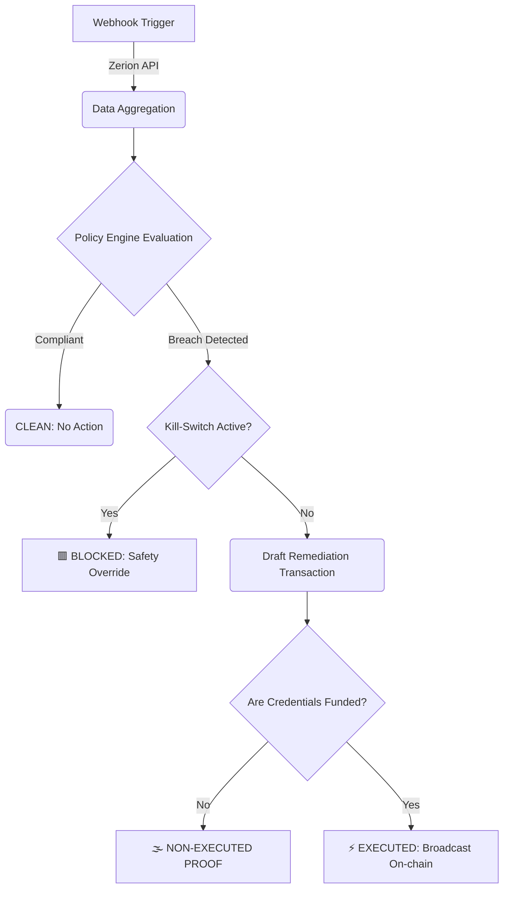

# 🏛️ Policy-Bounded Autonomous Treasury Guardian (Zerion)

> **Institutional-Grade Autonomous Asset Management for the Zerion Frontier**

An autonomous treasury guardian for the Zerion Frontier that drafts policy with AI assistance, but enforces every action through a **deterministic, fail-closed execution engine**. It monitors wallet-set data, reacts to webhooks, and executes real onchain rebalancing *only* when operator-approved guardrails allow it.

> [!IMPORTANT]
> **Hackathon Track Alignment:** This system is autonomous but explicitly bounded by operator-approved policy. It fulfills the core requirement of executing real on-chain transactions while prioritizing safety via a zero-trust footprint, rather than operating as an unbounded "god mode" bot.

---

## 🏛️ The Architecture: Bounded Autonomy

Unlike "black-box" agents that handle keys directly, the Guardian separates **Strategic Drafting** from **Operational Execution**:

1. **🤖 AI-Assisted Policy Drafting**: The AI agent analyzes treasury health and suggests rebalancing guardrails, but *only* operator-approved policies become active.
2. **⚙️ The Deterministic Engine**: The CLI translates active policies into binary, unbending guardrails. If a trade drift is not explicitly allowed, the engine defaults to a fail-closed `BLOCK` state.
3. **🔐 Secure Local Keystore**: Transactions are signed locally through the project’s encrypted keystore flow. This ensures the agent never handles raw private keys.

### The Execution Flow


---

## 🏆 For Judges: Proof of Correctness & Execution

We have eliminated "demo theater" by providing an authoritative **Judge Trace**, a single-screen proof of the system's internal state machine. 

### The Canonical State Machine
The Guardian evaluates the treasury and guarantees one of four unambiguous outcomes:
- ✅ **`CLEAN → NO ACTION REQUIRED`**: Treasury is compliant. No remediation needed.
- ⚡ **`BREACH → EXECUTED`**: A user-defined policy was exceeded; a remedial transaction was broadcast.
- 🟥 **`BREACH → BLOCKED`**: A policy was exceeded, but execution was arrested by the manual kill-switch or safety guardrail.
- 🌫️ **`BREACH → NON-EXECUTED PROOF`**: A policy was exceeded and a transaction was drafted/signed, but not broadcast (Simulation/Dry-Run).

### 🔍 Proof of Execution Artifacts
The Guardian provides deterministic artifacts to prove the system's external actions:
- **Real Execution (Provable):** When funded, it outputs a cryptographically verifiable transaction: `TX_HASH: 0x5c7b8d... (Track this on Etherscan/Solscan)`
- **Fallback (Simulation):** In dry-run mode, it produces a transparent proof of intent: `PROOF: NON-EXECUTED PROOF (Signed Transaction JSON)`

---

## 🔗 Deep Zerion Tech-Stack Integration

The Guardian natively leverages the full power of the Zerion infrastructure, incorporating bleeding-edge patterns from the `zerion-ai` platform:

*   **x402 Micro-Payments:** Supports the [x402 protocol](https://www.x402.org/) out of the box. No API key needed; agents can execute operations via automated `$0.01 USDC` pay-per-call handshakes.
*   **Wallet-Set Aggregation (`/wallet-sets/portfolio`):** Intelligently aggregates complex DAO and multi-sig holdings into one logical treasury before evaluating policy drift.
*   **Ready-to-Sign Swaps (`/swap/offers/`):** Consumes the swap routing API to instantly convert rebalance quotes into fully formed, signable execution intents without a separate building step.
*   **Transaction Subscriptions (`/tx-subscriptions`):** Deploys persistent webhook monitors that trigger autonomous evaluation cycles the moment relevant on-chain activity occurs.

---

## 🚀 Quick Start (The "Grand Finale" Demo)

To see the system in a complete institutional end-to-end flow, run our automated benchmark script. It walks through policy initialization, safety-override proofing, and the final high-fidelity judge trace.

```bash
# 1. Clone the repository and install dependencies
git clone https://github.com/THE-VARNA/zerion-ai.git
cd zerion-ai
npm install

# 2. Run the definitive Hackathon Demo
./demo.sh
```

> [!NOTE]  
> The `demo.sh` sequence guarantees a policy breach by applying an aggressive 1% concentration limit. This deliberately forces the Guardian to demonstrate its detection, evaluation, and remediation logic live.

---

## 🛡️ Key Highlights & Guardrails

| Feature | Institutional Benefit |
| :--- | :--- |
| **Chain-Aware Identity** | Uses Zerion chain-aware asset identifiers (CAIP-2) to avoid cross-chain identity collisions across **60+ EVM chains & Solana**. |
| **Automated Stop-Loss Mitigation** | Actively protects treasury downside by automatically liquidating crashing assets into stablecoins (`USDC`) when they breach a hard price floor. |
| **Concentration Limits** | Triggers auto-rebalancing when a single asset balloons past its predefined maximum portfolio allocation (e.g., automatically trimming 40% ETH exposure down to 30%). |
| **Fail-Closed Engine** | Inherently pessimistic. Defaults entirely to a `BLOCK` state if API data is malformed, missing, or if policy ambiguity is detected. |
| **Manual Kill-Switch** | A single-command physical arrest mechanism that can halt the autonomous daemon instantly returning safety to the operator. |
| **Append-Only Audit Log** | Maintains a persistent, machine-readable JSONL audit log for strict post-event reporting. |

---

## 🛠️ Command Reference

Control the autonomous daemon natively from the CLI:

| Command | Purpose |
| :--- | :--- |
| `zerion treasury judge-path` | **The Master Trace.** Prints the end-to-end logic proof. Displays the final state machine proof and execution artifact or audit-only fallback. |
| `zerion treasury status` | View the real-time Guardian Control Room & Audit Log. |
| `zerion treasury policies` | List current active rules and rebalancing targets. |
| `zerion treasury kill-switch on/off`| Instantly arrest or resume the autonomous daemon. |
| `zerion treasury start` | Launch the autonomous daemon for continuous background monitoring. |
| `zerion treasury trigger` | Manually force an evaluate + execute cycle sequence. |

---

*Built for the Zerion Frontier. Professional, Auditable, and Deterministically Safe.*
