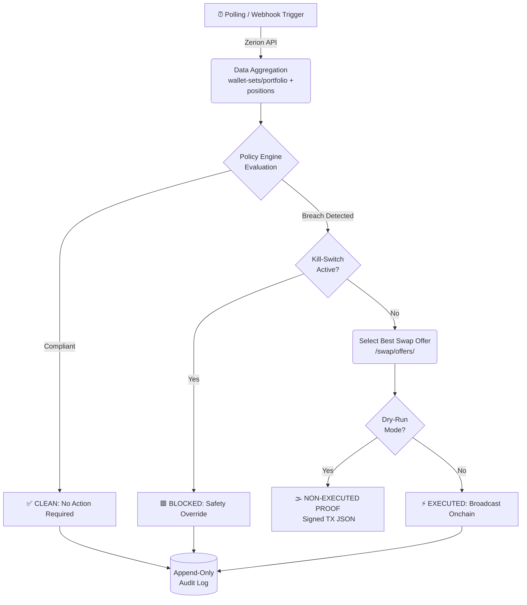

# 🏛️ Policy-Bounded Autonomous Treasury Guardian

> **Institutional-Grade Autonomous Asset Management — Zerion Frontier Hackathon**

An autonomous treasury guardian built as an institutional-grade extension of the [`zeriontech/zerion-ai`](https://github.com/zeriontech/zerion-ai) repository. It drafts policy with AI assistance, but enforces every action through a **deterministic, fail-closed execution engine**. It monitors wallet-set data, reacts to webhooks, and executes real onchain rebalancing *only* when operator-approved guardrails allow it.

> [!IMPORTANT]
> **Hackathon Track Alignment:** This system is autonomous but explicitly bounded by operator-approved policy. It fulfills the core requirement of executing real on-chain transactions while prioritizing safety via a zero-trust footprint — not a "god mode" bot.

---

## 🏛️ The Architecture: Bounded Autonomy

The core innovation is separating **Strategic Drafting** from **Deterministic Execution**, rather than building a black-box agent that controls keys directly.

| Layer | Role |
| :--- | :--- |
| **🤖 Strategic Layer** | AI (via Zerion MCP) analyzes wallet data and *proposes* rebalancing policies |
| **⚙️ Enforcement Layer** | Pure, idempotent Node.js engine. Deny-by-default: only allows trades explicitly defined in `treasury-policy.json` |
| **🔐 Signing Layer** | Transactions signed locally via encrypted keystore. Raw private keys never enter the evaluation loop |

### The Execution Flow



---

## 🏆 For Judges: The Complete Proof of Correctness

### The Canonical State Machine

Every evaluation cycle guarantees one of four unambiguous, machine-readable outcomes:

| State | Meaning |
| :--- | :--- |
| ✅ `CLEAN → NO ACTION REQUIRED` | Treasury is compliant. No remediation needed. |
| ⚡ `BREACH → EXECUTED` | Policy exceeded; remedial transaction broadcast onchain. |
| 🟥 `BREACH → BLOCKED` | Policy exceeded; execution arrested by kill-switch or safety guardrail. |
| 🌫️ `BREACH → NON-EXECUTED PROOF` | Policy exceeded; TX drafted & signed but not broadcast (Dry-Run/Simulation). |

### Run the Master Judge Trace

```bash
zerion treasury judge-path
```

This single command outputs the end-to-end logic proof: treasury snapshot → policy evaluation → state machine verdict → execution artifact or audit-only fallback.

### Proof of Execution Artifacts


- **Real Execution (Funded):** Outputs a cryptographically verifiable onchain hash.
  - **Live Demo Transaction:** [0xd6ca6078edb1f82f44ab715be8858c308af072c2fdfc778b9e15ff2c55e1e1a4](https://polygonscan.com/tx/0xd6ca6078edb1f82f44ab715be8858c308af072c2fdfc778b9e15ff2c55e1e1a4)
  - **Live Treasury Wallet:** [0xb78b...87e6b](https://polygonscan.com/address/0xb78b9025ca8b06bae4b390d0e0a9976608d87e6b)
- **Dry-Run Fallback:** Outputs a transparent signed simulation:
  `PROOF: NON-EXECUTED PROOF (Signed Zerion Swap TX JSON)`

---

## 🔗 Zerion Tech-Stack Integration

The Guardian natively leverages the full Zerion developer infrastructure:

| API Surface | How We Use It |
| :--- | :--- |
| **`/wallet-sets/portfolio`** | Aggregates multi-wallet DAO/multi-sig holdings into one logical treasury view |
| **`/wallet-sets/positions/`** | Fetches live, chain-aware positions to evaluate concentration drift |
| **`/swap/offers/`** | Converts rebalance intents into ready-to-sign transaction objects in a single call |
| **`/tx-subscriptions`** | Deploys persistent webhooks to trigger evaluation cycles on live onchain activity |
| **x402 Protocol** | Full pay-per-call support via [`x402`](https://www.x402.org/). No API key needed — uses `$0.01 USDC` micro-payment handshakes |

---

## 🛡️ Key Highlights & Guardrails

| Feature | Implementation Detail |
| :--- | :--- |
| **Automated Stop-Loss** | Auto-liquidates crashing assets into USDC when they breach a hard price floor (`triggerPriceUsd`) |
| **Concentration Limits** | Auto-rebalances when a single asset exceeds its maximum allocation (e.g., trims 40% ETH → 30%) |
| **Absolute Spend Caps** | Hard algorithmic ceiling on USD value per rebalance cycle (`spendCapUsd`) — mathematically bounds max exposure |
| **Time-Bounded Policies** | All authorizations carry an ISO-8601 expiry (`expiresAt`) — abandoned agents cannot trade on stale policy |
| **Poison Payload Prevention** | Detects and drops zero-value/NaN/Infinity spam assets before they enter policy evaluation |
| **Idempotency Ring Buffer** | UUID per cycle tracked in a 200-entry ring buffer — prevents replay attacks and runaway trade loops |
| **Exponential Retry Backoff** | API fetches retry up to 3× with 1s → 2s → 4s delays before defaulting to `BLOCKED` |
| **Fail-Closed Engine** | Any malformed data, API error, or policy ambiguity defaults to `BLOCKED` — never executes speculatively |
| **System-Level Kill-Switch** | File-based (`~/.zerion/treasury-kill-switch`) zero-latency daemon arrest, verifiable via `ls` |
| **Append-Only Audit Log** | Every cycle decision, price point, and trade offer recorded to `~/.zerion/treasury-audit.jsonl` |
| **Chain-Aware Identity (CAIP-2)** | Every asset uniquely identified across 60+ EVM chains & Solana — no cross-chain symbol collisions |

---

## 🧑‍⚖️ For Judges: How to Test and Follow

We have made it incredibly easy for you to run the Treasury Guardian locally on your machine and verify the deterministic logic yourself, **without needing any private keys**.

### Step 1: Clone and Install
```bash
git clone https://github.com/THE-VARNA/zerion-ai.git
cd zerion-ai
npm install
```

### Step 2: Set your API Key
You only need a Zerion API key to run the simulation (get one at [developers.zerion.io](https://developers.zerion.io)).
```bash
export ZERION_API_KEY=zk_dev_your_key_here
```

### Step 3: Run the Automated Dry-Run Demo
We created a safe, automated simulation script that proves the state machine works perfectly without spending any real money.
```bash
./demo.sh
```

**What you will see:**
1. **Live Portfolio:** Fetches real assets using the Zerion API.
2. **The Kill-Switch:** Proves that if safety locks are engaged, execution is instantly blocked (`BREACH → BLOCKED`).
3. **The Master Trace:** Evaluates the policy, detects a concentration limit breach, and generates a signed transaction proof (`BREACH → NON-EXECUTED PROOF`).
4. **The Audit Log:** Proves that every decision was permanently written to an append-only ledger.

*(To see a real, live on-chain execution with our funded wallet, please watch our demo video or see the transaction hash linked above!)*

---

## 🛠️ Detailed Command Reference

We built the CLI to be incredibly simple and easy to use. Here is exactly what each command does, step-by-step:

### 1. View Your Policies
```bash
node cli/zerion.js treasury policies
```
**What it does:** Shows you the exact safety rules the agent is following (like your 1% concentration limit and $2.50 spend cap). It proves the agent is bounded by strict math.

### 2. Check the Live Portfolio
```bash
node cli/zerion.js portfolio <YOUR_WALLET_ADDRESS>
```
**What it does:** Fetches your live wallet balances from the Zerion API. Use this to easily check if any of your tokens are currently breaching your safety limits.

### 3. Generate the Judge Trace
```bash
node cli/zerion.js treasury judge-path
```
**What it does:** This is the ultimate proof command. It runs a full, dry-run simulation of the policy engine and prints out the final deterministic state (e.g., `CLEAN`, `EXECUTED`, or `BLOCKED`). It does not spend any real money.

### 4. Execute a Live Autonomous Trade
```bash
node cli/zerion.js treasury trigger
```
**What it does:** Turns the Guardian on in LIVE mode. It will detect any policy breaches, fetch a live swap route, securely sign the transaction, and broadcast it to the blockchain. **Warning: This will execute real trades.**
*(Tip: Add `--dry-run` to the end of this command to safely test it first).*

### 5. Use the Hardware Kill-Switch
```bash
node cli/zerion.js treasury kill-switch on
node cli/zerion.js treasury kill-switch off
```
**What it does:** The ultimate safety net. Turning the kill-switch `on` instantly arrests the agent and prevents it from doing anything, even if a breach is detected. Turning it `off` arms the Guardian again.

### 6. View the Audit Log
```bash
node cli/zerion.js treasury status
```
**What it does:** Opens the Guardian Control Room to show you the append-only audit log. Every single decision the agent has ever made is permanently recorded here for institutional compliance.

---

## 🧪 Running the Test Suite

We believe in rigorous safety. We have written a comprehensive suite of unit and integration tests covering the policy engine, security edge cases, safety guardrails, and CLI routing.

To run the full test suite locally:
```bash
npm test
```
**What it tests:**
- `treasury-policy.test.mjs`: Ensures policies correctly trigger and enforce mathematically sound rebalance amounts.
- `treasury-safety.test.mjs`: Validates that the kill-switch and fail-closed logic correctly block execution.
- `treasury-security-edge.test.mjs`: Tests extreme edge cases (like zero-value tokens, infinite slippage, and malformed config files) to guarantee the engine never panics or executes bad trades.

---

## ⚙️ Environment Variables

| Variable | Purpose |
| :--- | :--- |
| `ZERION_API_KEY` | Standard API key (get one at [developers.zerion.io](https://developers.zerion.io)) |
| `WALLET_PRIVATE_KEY` | EVM key for x402 pay-per-call (no API key needed) |
| `TREASURY_WALLET_PASSPHRASE` | Passphrase for local keystore signing during live execution |
| `TREASURY_POLICY_PATH` | Custom path to `treasury-policy.json` (default: `~/.zerion/treasury-policy.json`) |

---

*Built for the Zerion Frontier. Professional, Auditable, and Deterministically Safe.*
